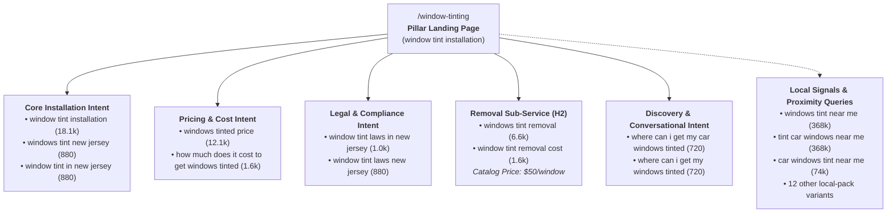

# Window Tinting: Topic Cluster & Wireframe Specification

**Vertical:** Automotive Window Tinting (Installation & Removal)  
**Canonical URL:** `https://www.cleanworxnj.com/window-tinting`  
**Page Priority:** P0 (Core Service Landing Page)  
**Business:** CleanWorx Auto Detailing & Ceramic Coating  
**Market:** Basking Ridge, NJ and verified 20–25 mile service radius (Somerset & Morris Counties)  
**Keyword Source:** `keyword research CLEANWORX v2.csv` (26 tint keywords; 850,000+ total query volume)  
**Operational Catalog Sources:** [CATALOGO-SERVICIOS-SQUARE-2026-09-23.md](./CATALOGO-SERVICIOS-SQUARE-2026-09-23.md) & [BUSINESS-FACTS-AND-SOURCE-RULES.md](./BUSINESS-FACTS-AND-SOURCE-RULES.md)  
**Updated:** 2026-09-26  

---

## 1. Executive Summary & Strategic Architecture

CleanWorx is expanding its core service offering by establishing a dedicated automotive **Window Tinting** vertical. This service is housed on a single, authoritative canonical landing page: **`/window-tinting`**.

### Key Strategic Directives
1. **Unified Service & Sub-Service Architecture:** To avoid keyword cannibalization and thin duplicate pages, the canonical route `/window-tinting` covers both **Window Tint Installation** (primary topic) and **Window Tint Removal** (secondary sub-service housed in a dedicated H2 section near the end of the page).
2. **Catalog-Backed Pricing:** Window tint removal is a catalog-confirmed service in CleanWorx's Square system at **USD 50.00 per window** (30 mins). Tint installation is assessment-led based on vehicle class, number of windows, and film technology (Carbon vs. Ceramic).
3. **Local Search & Proximity Differentiation:** Proximity modifiers like `near me` and `nearby` (which account for over 800,000 national searches across variants) are treated strictly as proximity signals for Google Maps/Local Pack rankings, not as on-page keyword targets. On-page targeting is focused on the core service topics, New Jersey legal compliance, and regional relevance centered on Basking Ridge, NJ.
4. **Controlled Studio Environment:** Unlike basic detailing, precision window tint installation demands a climate-controlled, dust-minimized indoor environment. Work is performed at the CleanWorx studio at 19 E. Henry Street, Basking Ridge, NJ.

---

## 2. Topic Cluster Architecture & Search Intent Mapping

The window tinting vertical is structured around five core intent pillars supporting the master pillar page:



### Intent Breakdown & Cluster Roles

| Cluster Node | Primary Search Intent | Target Keywords (CLEANWORX v2.csv) | Content Placement on `/window-tinting` |
| --- | --- | --- | --- |
| **Node 1: Installation** | Commercial / Transactional | `window tint installation` (18,100), `windows tint new jersey` (880), `window tint in new jersey` (880) | Hero, H1, Film Technology, Shade Options, Installation Process |
| **Node 2: Pricing / Cost** | Commercial / Evaluative | `windows tinted price` (12,100), `how much does it cost to get windows tinted` (1,600) | Dedicated Pricing Section: starting price ranges by vehicle category & film grade |
| **Node 3: NJ Regulations** | Informational / Trust | `window tint laws in new jersey` (1,000), `window tint laws new jersey` (880) | Dedicated Section on NJ MVC Title 39 compliance, front/rear glass rules, medical exemptions |
| **Node 4: Tint Removal (H2)** | Transactional / Problem-Solving | `windows tint removal` (6,600), `window tint removal cost` (1,600) | Dedicated H2 Section near bottom: safe steam removal, defroster grid protection, $50/window |
| **Node 5: Discovery** | Navigational / Informational | `where can i get my car windows tinted` (720), `where can i get my windows tinted` (720) | Local proof, studio address in Basking Ridge, FAQ section |
| **Node 6: Proximity Variants** | Local Proximity / Map Pack | 15 variants totaling 820k+ searches (`windows tint near me`, `tint car windows near me`, etc.) | Earned via GBP consistency, address, Basking Ridge & service area schema, not on-page text |

---

## 3. Complete Keyword Ledger (Window Tint Vertical)

All 26 keywords from `keyword research CLEANWORX v2.csv` related to window tinting are mapped below with their specific role, search metrics, and on-page implementation guidance:

| No. in CSV | Keyword | Search Volume | CPC (USD) | Paid Diff | SEO Diff | Role / Placement on `/window-tinting` |
| ---: | --- | ---: | ---: | ---: | ---: | --- |
| 82 | **window tint installation** | 18,100 | $5.08 | 14 | 34 | **Primary Page Keyword** (H1, title tag, primary CTA context) |
| 22 | **windows tinted price** | 12,100 | $3.18 | 83 | 41 | **Primary Pricing Keyword** (H2 pricing heading, cost guide) |
| 101 | **windows tint removal** | 6,600 | $2.35 | 28 | 23 | **Primary Removal Keyword** (Dedicated H2 removal section) |
| 11 | **how much does it cost to get windows tinted** | 1,600 | $4.58 | 51 | 10 | Secondary Pricing Keyword (FAQ accordion & pricing copy) |
| 35 | **window tint removal cost** | 1,600 | $1.92 | 5 | 14 | Secondary Removal Keyword (Removal section & Square catalog $50 quote) |
| 28 | **window tint laws in new jersey** | 1,000 | $2.36 | 2 | 24 | Legal Authority Keyword (NJ compliance section & FAQ) |
| 119 | **windows tint new jersey** | 880 | $4.29 | 62 | 24 | Regional Commercial Keyword (Body copy, intro, service-area context) |
| 123 | **window tint in new jersey** | 880 | $4.29 | 62 | 24 | Regional Commercial Keyword (Process & studio context) |
| 136 | **window tint laws new jersey** | 880 | $0.02 | 2 | 17 | Legal Authority Keyword (Supporting FAQ & legal guidance) |
| 16 | **where can i get my car windows tinted** | 720 | $5.00 | 73 | 21 | Conversational Search Keyword (Why choose CleanWorx / FAQ) |
| 127 | **where can i get my windows tinted** | 720 | $5.85 | 72 | 17 | Conversational Search Keyword (FAQ & local service direction) |
| 19 | *windows tint near me* | 368,000 | $4.51 | 75 | 57 | Proximity Signal (GBP/NAP, LocalBusiness schema) |
| 12 | *tint car windows near me* | 368,000 | $5.21 | 75 | 26 | Proximity Signal (Local Pack optimization) |
| 141 | *car windows tint near me* | 74,000 | $4.59 | 56 | 44 | Proximity Signal (Local Pack optimization) |
| 13 | *windows tint nearby* | 5,400 | $4.93 | 47 | 29 | Proximity Signal (Local Pack optimization) |
| 72 | *window tint service near me* | 5,400 | $4.98 | 30 | 36 | Proximity Signal (Local Pack optimization) |
| 8 | *window tint prices near me* | 4,400 | $2.62 | 62 | 25 | Proximity Signal (Pricing intent / GBP service listing) |
| 54 | *window tint removal near me* | 1,600 | $5.41 | 59 | 20 | Proximity Signal (Removal intent / GBP secondary category) |
| 106 | *window tint installation near me* | 1,300 | $9.93 | 55 | 59 | Proximity Signal (Installation intent / Local Pack) |
| 81 | *window tint companies near me* | 1,000 | $8.08 | 63 | 35 | Proximity Signal (Brand & provider search) |
| 44 | *auto window tinting near me prices* | 880 | $3.79 | 93 | 19 | Proximity Signal (Pricing intent / Local Pack) |
| 117 | *car windows tint near me prices* | 880 | $4.34 | 81 | 27 | Proximity Signal (Pricing intent / Local Pack) |
| 52 | *car window tint service near me* | 480 | $4.23 | 25 | 19 | Proximity Signal (Service intent / Local Pack) |
| 6 | *professional window tint near me* | 390 | $6.37 | 55 | 16 | Proximity Signal (Quality intent / Local Pack) |
| 87 | *where can i get my windows tinted near me* | 390 | $5.53 | 74 | 24 | Proximity Signal (Local search intent) |
| 20 | *car window tint removal near me* | 260 | $5.00 | 73 | 20 | Proximity Signal (Removal intent / Local Pack) |

---

## 4. Semantic Entity Framework & LSI Vocabulary

To build authoritative topical depth and prepare the page for AI search citations (GEO / Perplexity / Google AI Overviews), the content must naturally integrate key industry entities:

- **Film Types:** Ceramic window film, Nano-ceramic technology, High-performance carbon film, Dyed polyester film (contrast as lower tier).
- **Performance Metrics:** Visible Light Transmission (VLT), Total Solar Energy Rejection (TSER), Infrared Rejection (IRR), Ultraviolet (UV) Protection (99% UV-A and UV-B blocking), Glare reduction percentage.
- **Glass & Installation Components:** Windshield visor / AS-1 line, front side windows, rear quarter glass, rear windshield, rear defroster grid lines, integrated glass radio/GPS antennas, computer-cut plotting, heat forming/shrinking.
- **Defects & Removal Terminology:** Thermal adhesive degradation, bubbling film, purple fading (dye breakdown), dry adhesive residue, chemical-free steam extraction.
- **Legal & Regulatory Entities:** New Jersey Motor Vehicle Commission (NJ MVC), New Jersey Title 39 (N.J.S.A. 39:3-74), Sunscreening medical exemptions.

---

## 5. Comprehensive UX & SEO Page Wireframe

### URL Structure & Metadata
- **Canonical Route:** `/window-tinting`
- **Breadcrumb Hierarchy:** `Home > Services > Window Tinting`
- **Title Tag:** `Window Tint Installation in Basking Ridge, NJ | CleanWorx`
- **Meta Description:** `Professional window tint installation in Basking Ridge, NJ. Premium ceramic & carbon films, 99% UV protection, NJ legal tint compliance & safe tint removal from $50/window.`
- **Target Word Count:** 1,200–1,600 words of rich, structured, authoritative copy.

---

### Wireframe Sections & Content Hierarchy

```text
================================================================================
HEADER & GLOBAL NAVIGATION
[Services (Dropdown) | Our Work | About | FAQ | Contact]  [Call 908-899-2832] [Book Now]
================================================================================
BREADCRUMBS: Home > Services > Window Tinting
================================================================================

SECTION 1: HERO & CONVERSION HOOK
--------------------------------------------------------------------------------
H1: Professional Window Tint Installation in Basking Ridge, NJ
Subhead: Enhance driving comfort, block 99% of harmful UV rays, and reduce interior
heat with studio-precision ceramic and carbon window films installed by CleanWorx.
[Button: Request a Window Tint Quote] [Button: Call 908-899-2832]

Trust Highlights Bar:
[Icon: 99% UV Protection] [Icon: Up to 85% IR Heat Rejection] [Icon: NJ Legal Compliance] [Icon: Studio Dust-Free Bay]
--------------------------------------------------------------------------------

SECTION 2: KEY BENEFITS OF AUTOMOTIVE TINTING
--------------------------------------------------------------------------------
H2: Drive in Comfort: Solar Heat Rejection, UV Defense, and Glare Reduction
Intro copy explaining why window tinting is both a comfort and vehicle-preservation investment.

Grid of 4 Benefit Cards:
1. Solar Heat Rejection: Blocks intense infrared rays so your cabin stays cooler, reducing A/C strain.
2. 99% UV Ray Protection for Leather and Interiors: Safeguards skin and prevents dashboard cracking, leather fading, and upholstery wear.
3. Glare Reduction & Driving Safety: Cuts harsh sunlight and nighttime headlight glare for safer driving.
4. Privacy & Interior Security: Deters prying eyes from seeing personal belongings inside your vehicle.
--------------------------------------------------------------------------------

SECTION 3: FILM TECHNOLOGY OPTIONS (CERAMIC VS. CARBON)
--------------------------------------------------------------------------------
H2: Premium Film Technology: Ceramic vs. Carbon Window Tint
Educational breakdown of film options available at CleanWorx.

Side-by-Side Comparison:
- Ceramic Window Film (The Gold Standard):
  • Utilizes non-conductive ceramic nanoparticles.
  • Maximum Infrared (IR) heat rejection without needing dark shades.
  • Zero electronic interference (no disruption to GPS, cellular, or keyless entry).
  • Superior optical clarity day and night.
- High-Performance Carbon Film:
  • Matte black, non-reflective finish that never fades purple.
  • Reliable solar heat absorption and 99% UV rejection.
  • Durable color stability and great value for everyday drivers.
--------------------------------------------------------------------------------

SECTION 4: SHADE & VLT SELECTION GUIDE
--------------------------------------------------------------------------------
H2: Choosing Your Shade: Visible Light Transmission (VLT) Options
Visual and descriptive guide explaining how VLT works and common shade applications.

Shade Cards:
- 70% VLT (Near-Clear): Ideal for front windshields and windshield visor strips where maximum optical clarity and pure heat/UV rejection are required.
- 50% VLT (Subtle Tint): Light shading that adds modest elegance while keeping cabin visibility high.
- 35% VLT (Balanced Luxury): Popular factory-style look offering great privacy, glare reduction, and refined aesthetics.
- 20% VLT (Factory Match): Closely matches standard rear privacy glass on SUVs, crossovers, and trucks.
- 5% VLT (Limo Privacy): Maximum privacy for rear cargo areas and executive transport.
--------------------------------------------------------------------------------

SECTION 5: NEW JERSEY WINDOW TINT REGULATIONS
--------------------------------------------------------------------------------
H2: Window Tint Laws in New Jersey: Legal Compliance & VLT Rules
Factual, transparent legal guide establishing CleanWorx as a knowledgeable, trustworthy installer.

Content Blocks:
- Windshield Regulations: Non-reflective tint allowed only along the top AS-1 line (or upper 6 inches of the windshield).
- Front Side Windows (Driver & Passenger): New Jersey window tint laws prohibit aftermarket tint on front side windows unless the vehicle owner possesses an approved NJ MVC Medical Sunscreening Permit.
- Rear Side & Back Windows: Any level of darkness (VLT) is legally permitted on rear side windows and the rear windshield, provided the vehicle is equipped with dual exterior side mirrors.
- CleanWorx Guidance: We walk every client through compliance options under window tint laws in New Jersey so you can choose the ideal balance of legal adherence, heat rejection, and aesthetic appeal.
--------------------------------------------------------------------------------

SECTION 6: PRECISION 5-STAGE INSTALLATION PROCESS
--------------------------------------------------------------------------------
H2: Precision Window Tint Installation: Our 5-Stage Process
Explains why CleanWorx studio tinting outperforms rushed mobile tinting.

Step 1: Vehicle & Glass Preparation (Checking glass condition, micro-scratches, seals, and deep cleaning).
Step 2: Intensive Glass Decontamination (Multi-stage chemical and mechanical cleaning to remove dust, sap, and road oils).
Step 3: Computer-Cut Precision and Heat Contouring (Precision pattern plotting and custom hand-formed heat shrinking to match glass curvature perfectly).
Step 4: Dust-Free Bay Application (Slip-solution squeegee extraction in our clean indoor bay to lock film without bubbles or contaminants).
Step 5: Edge Inspection and Quality Control (Checking optical clarity, perimeter adhesion, and water dissipation).
--------------------------------------------------------------------------------

SECTION 7: PRICING GUIDE & VEHICLE VARIABLES
--------------------------------------------------------------------------------
H2: Windows Tinted Price Guide: How Much Does It Cost to Get Windows Tinted?
Directly addressing high-volume search demand for 'windows tinted price' and 'how much does it cost to get windows tinted'.

Pricing Variables Guide:
- Pricing Factors: Vehicle category (Coupe, Sedan, Truck, SUV), number of glass panels tinted, and selected film technology (Carbon vs. Ceramic).
- Starting Scope Estimates:
  • Two Front Windows: Starting from standard studio rates.
  • Full Sides & Rear (Coupe / Sedan): Assessment-led full package pricing.
  • Full Sides & Rear (SUV / Van / Truck): Scaled to larger glass surface areas.
  • Windshield Eyebrow / Full Ceramic Windshield: Add-on pricing available upon consultation.
- Callout: Every installation is backed by high-grade film warranties against bubbling, peeling, and color fading. Final quotes are confirmed during pre-work inspection.
[Button: Get Your Vehicle Tint Quote]
--------------------------------------------------------------------------------

SECTION 8: DEDICATED SUB-SERVICE — PROFESSIONAL WINDOW TINT REMOVAL
--------------------------------------------------------------------------------
H2: Professional Windows Tint Removal in Basking Ridge, NJ
Directly targeting 'windows tint removal' (6,600/mo) and 'window tint removal cost' (1,600/mo).

Context & Problem Statement:
Old, degraded window tinting eventually bubbles, turns purple, blisters, or peels—impairing
visibility and ruining your vehicle's appearance. In other cases, vehicles purchased with
illegal front tint must have it removed to pass state inspections or avoid citations.

The Critical Risk of DIY Removal:
Amateur attempts to scrape off old tint often sever the delicate rear window defroster grid
lines and radio antenna elements printed onto the glass, resulting in thousands of dollars in
rear windshield replacement costs.

The CleanWorx Steam-Removal Solution:
- Specialized thermal steam extraction that softens stubborn adhesive without razor blades.
- Safe for sensitive defroster grids, antenna circuits, and heated rear glass.
- Complete removal of sticky glue residue and hazy film layers.
- Glass left spotless, decontaminated, and ready for fresh film or clean factory visibility.

H3: Window Tint Removal Cost: USD 50.00 per Window
• Price: USD 50.00 per window (Fixed Square Catalog Price)
• Duration: Approximately 30 minutes per window
• Availability: Standalone service or paired with new window tint installation.
[Button: Schedule Tint Removal] [Call for Removal Assessment: 908-899-2832]
--------------------------------------------------------------------------------

SECTION 9: CURING & AFTERCARE PROTOCOL
--------------------------------------------------------------------------------
H2: Window Tint Curing and Aftercare Guidelines
Essential maintenance instructions to protect customer investment and prevent premature damage.

- The Curing Period: Keep windows completely rolled up for 3 to 5 days after installation while residual moisture evaporates.
- Normal Haze / Moisture Pockets: Minor water pockets or slight haziness during the first 72 hours are normal as the adhesive bonds to the glass.
- Cleaning Instructions: Use only ammonia-free automotive glass cleaners and plush microfiber towels; never use abrasive sponges or ammonia-based household sprays.
--------------------------------------------------------------------------------

SECTION 10: STUDIO LOCATION & SERVICE AREA
--------------------------------------------------------------------------------
H2: Where Can I Get My Car Windows Tinted in New Jersey? CleanWorx Studio
Directly capturing conversational queries 'where can i get my car windows tinted' and geo-target 'window tint in new jersey'.

Copy:
Achieving a flawless, dust-free tint finish requires an enclosed, climate-controlled studio
free from outdoor breeze, pollen, dust, and temperature swings. All window tinting services
are performed at our dedicated facility:
CleanWorx Auto Detailing & Ceramic Coating
19 E. Henry Street, Basking Ridge, NJ 07920
Hours: Monday–Saturday, 9:00 AM–5:00 PM | Closed Sunday

Serving Drivers Across: Basking Ridge, Bernardsville, Bedminster, Warren, Bridgewater,
Westfield, Morristown, Mendham, Chester, and surrounding Somerset & Morris County communities.
--------------------------------------------------------------------------------

SECTION 11: FREQUENTLY ASKED QUESTIONS
--------------------------------------------------------------------------------
H2: Frequently Asked Questions About Windows Tint in New Jersey
Targeting 'windows tint new jersey' and high-intent voice/conversational search queries.

Accordion Items:
H3: How Much Does It Cost to Get Windows Tinted?
A: Window tint pricing depends on your vehicle's make and model, the number of windows being tinted, and the film technology you choose (Carbon vs. Ceramic). Two-door front matching is more affordable than a full-vehicle package on a three-row SUV. Contact CleanWorx for a tailored, upfront quote based on your exact vehicle.

H3: Is Window Tint Legal in New Jersey?
A: Under New Jersey window tint laws (N.J.S.A. 39:3-74), no tint is allowed on front driver or passenger side windows without an official NJ MVC medical exemption permit. The windshield can only feature a tint strip along the top AS-1 line (upper 6 inches). Rear side windows and the rear windshield can be tinted to any shade (VLT), provided the vehicle has dual side mirrors. We guide you through compliant options.

H3: Where Can I Get My Windows Tinted by Certified Installers?
A: For drivers in Somerset and Morris Counties asking 'where can i get my windows tinted', CleanWorx provides studio-grade installation at 19 E. Henry Street in Basking Ridge, NJ.

H3: What Is the Difference Between Ceramic and Carbon Film?
A: Carbon tint uses carbon particles to create a rich matte finish with strong UV rejection and solid heat absorption without ever turning purple. Ceramic tint incorporates microscopic nano-ceramic particles that block up to 85%+ of infrared heat, providing the highest thermal comfort available without interfering with electronic signals.

H3: Can You Remove Old, Bubbling, or Purple Tint?
A: Yes! We provide professional window tint removal using safe thermal steam extraction. We safely dissolve old glue and remove degraded film without scratching glass or damaging delicate rear defroster lines.

H3: How Much Does Window Tint Removal Cost?
A: Our published Square catalog price for window tint removal cost is USD 50.00 per window, taking approximately 30 minutes per window. We can remove tint from a single damaged window, strip illegal front tint, or perform full vehicle removal.

H3: How Long Does Window Tint Take to Dry and Cure?
A: The tint adhesive typically takes 3 to 5 days to cure completely, depending on ambient temperature and sun exposure. You must keep your windows rolled up during this period. Small water bubbles or light haziness during the first few days are part of the natural evaporation process and will disappear.

H3: Will Tint Removal Ruin My Rear Window Defrosters?
A: When done improperly with razor blades, yes. However, CleanWorx uses a gentle steam-softening technique specifically designed to lift the film and glue without touching or cutting the printed defroster lines or glass antennas.

H3: Can Window Tinting Be Done Mobile at My Home?
A: Unlike routine detailing, window tint installation requires a strictly controlled, indoor environment free from airborne dust, wind, and direct temperature extremes to avoid debris getting trapped beneath the film. For this reason, all tint installation is completed at our Basking Ridge studio.
--------------------------------------------------------------------------------

SECTION 12: FINAL CONVERSION & CONTACT BLOCK
--------------------------------------------------------------------------------
H2: Schedule Your Window Tint Installation in Basking Ridge, NJ
Closing value statement and clear appointment CTA.
[Button: Request Window Tint Quote] [Button: Call 908-899-2832]
CleanWorx Auto Detailing & Ceramic Coating · 19 E. Henry Street, Basking Ridge, NJ 07920
================================================================================
FOOTER: Links to all services, Service Areas, Our Work, About, FAQ, Contact, NAP data.
================================================================================
```

---

## 6. Technical SEO, Metadata & Schema.org Specification

### 1. Route Metadata
```typescript
export const metadata: Metadata = {
  title: "Window Tint Installation in Basking Ridge, NJ | CleanWorx",
  description:
    "Professional window tint installation in Basking Ridge, NJ. Premium ceramic & carbon films, 99% UV block, NJ legal tint compliance & safe tint removal from $50/window.",
  alternates: {
    canonical: "https://www.cleanworxnj.com/window-tinting",
  },
  openGraph: {
    title: "Window Tint Installation in Basking Ridge, NJ | CleanWorx",
    description:
      "Expert automotive window tinting and tint removal in Basking Ridge. Ceramic heat-rejection films, UV protection, and cleanroom-grade installation.",
    url: "https://www.cleanworxnj.com/window-tinting",
    siteName: "CleanWorx Auto Detailing & Ceramic Coating",
    locale: "en_US",
    type: "website",
  },
};
```

### 2. JSON-LD Structured Data (`Service` + `BreadcrumbList`)
```html
<script type="application/ld+json">
{
  "@context": "https://schema.org",
  "@graph": [
    {
      "@type": "BreadcrumbList",
      "itemListElement": [
        {
          "@type": "ListItem",
          "position": 1,
          "name": "Home",
          "item": "https://www.cleanworxnj.com"
        },
        {
          "@type": "ListItem",
          "position": 2,
          "name": "Services",
          "item": "https://www.cleanworxnj.com/services"
        },
        {
          "@type": "ListItem",
          "position": 3,
          "name": "Window Tinting",
          "item": "https://www.cleanworxnj.com/window-tinting"
        }
      ]
    },
    {
      "@type": "Service",
      "@id": "https://www.cleanworxnj.com/window-tinting#service",
      "name": "Automotive Window Tint Installation & Removal",
      "serviceType": "Window Tinting",
      "description": "Professional automotive window tint installation and safe tint removal in Basking Ridge, NJ. Ceramic and carbon heat-rejection films with 99% UV block.",
      "provider": {
        "@type": "AutoDetailing",
        "name": "CleanWorx Auto Detailing & Ceramic Coating",
        "telephone": "908-899-2832",
        "email": "cleanworxnj@gmail.com",
        "address": {
          "@type": "PostalAddress",
          "streetAddress": "19 E. Henry Street",
          "addressLocality": "Basking Ridge",
          "addressRegion": "NJ",
          "postalCode": "07920",
          "addressCountry": "US"
        },
        "url": "https://www.cleanworxnj.com"
      },
      "areaServed": [
        {
          "@type": "City",
          "name": "Basking Ridge"
        },
        {
          "@type": "AdministrativeArea",
          "name": "Somerset County"
        },
        {
          "@type": "AdministrativeArea",
          "name": "Morris County"
        }
      ],
      "hasOfferCatalog": {
        "@type": "OfferCatalog",
        "name": "Window Tint Services",
        "itemListElement": [
          {
            "@type": "Offer",
            "itemOffered": {
              "@type": "Service",
              "name": "Ceramic Window Tint Installation",
              "description": "Nano-ceramic heat rejection film blocking 99% UV and up to 85% infrared heat."
            },
            "priceCurrency": "USD",
            "priceSpecification": {
              "@type": "PriceSpecification",
              "description": "Price varies by vehicle size and window count."
            }
          },
          {
            "@type": "Offer",
            "itemOffered": {
              "@type": "Service",
              "name": "Tint Removal (Per Window)",
              "description": "Safe steam removal of old, bubbling, or illegal window tint without defroster damage."
            },
            "price": "50.00",
            "priceCurrency": "USD"
          }
        ]
      }
    }
  ]
}
</script>
```

---

## 7. Internal Linking & Anti-Cannibalization Matrix

To maximize link equity and prevent internal cannibalization, the `/window-tinting` URL integrates into the CleanWorx site architecture as follows:

| Source Page | Target Page | Contextual Anchor Text | Strategic Purpose |
| --- | --- | --- | --- |
| **`/` (Homepage)** | `/window-tinting` | “window tint installation” / “automotive window tinting” | Passes core authority from homepage service chooser to the new vertical. |
| **`/services` (Hub)** | `/window-tinting` | “Window Tinting” (Service Card) | Discovery navigation for users exploring shop capabilities. |
| **`/window-tinting`** | `/ceramic-coating` | “System X ceramic coating” / “paint protection” | Cross-sell: Pairing glass heat protection with exterior paint ceramic protection. |
| **`/window-tinting`** | `/interior-detailing` | “interior car detailing” | Cross-sell: Protecting newly conditioned leather/fabrics with UV-blocking window film. |
| **`/window-tinting`** | `/` | “CleanWorx auto detailing” | Upward breadcrumb & brand equity flow. |
| **`/window-tinting`** | `/service-areas` | “Basking Ridge and nearby communities” | Local relevance signal reinforcement. |
| **`/window-tinting`** | `/contact` | “contact our Basking Ridge studio” | Direct conversion path for custom quotes. |
| **`/our-work`** | `/window-tinting` | “window tinting for this [Vehicle Model]” | Project-specific proof links back to the service landing page. |
| **`/ceramic-coating`** | `/window-tinting` | “ceramic window tinting” | Suggesting total vehicle thermal & UV protection package. |

### Anti-Cannibalization Rule
- Do **not** create a separate `/window-tint-removal` URL. Window tint removal has strong query volume (6,600/mo), but user intent is tightly coupled with tint replacement or immediate fix. Housing it as an H2 section on `/window-tinting` preserves page authority, provides a superior user experience, and matches CleanWorx's service scope.
- Do **not** create a `/window-tint-cost` or `/window-tint-prices` URL. All cost queries (`windows tinted price`, `how much does it cost to get windows tinted`) are answered definitively in Section 7 of `/window-tinting`.
